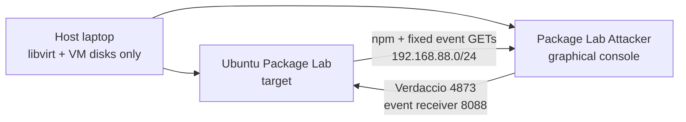

<callout icon="✅" color="green_bg">
	**AUTHORITATIVE HANDOFF — verified 26 August 2026.** This page is the single current source of truth for the Binary Poison Package lab. The two-VM chain is running, reboot-tested, presentation-ready, and snapshotted. Older pages remain below as research/design history and are explicitly marked superseded.
</callout>
<table_of_contents/>

## Executive summary

The exercise reproduces a realistic **slopsquatting** chain: an AI-assisted developer workflow trusts the historically hallucinated npm name `react-codeshift`; `npx` downloads and runs the attacker-controlled CLI as the ordinary developer; a later routine APT transaction causes vulnerable `needrestart` to load the armed developer-controlled import object with EUID 0.

The implementation stops at visible, fixed-destination lab telemetry. It has **no interactive shell, command channel, credential collection, lateral movement, destructive action, or Internet callback**. Both the user-armed state and the retained-root state survive reboots and report only their scoring state to the attacker console.

The scenario basis and historical references were consolidated from <mention-page url="https://app.notion.com/p/3bc24bd4cf6a811e8153c9119f92e4be">the concept brief</mention-page>, <mention-page url="https://app.notion.com/p/3bc24bd4cf6a818e9812d7e8fd0fe079">the hosting requirements</mention-page>, <mention-page url="https://app.notion.com/p/3c724bd4cf6a81fbbcc1e7986ec0eb12">the verified execution map</mention-page>, and <mention-page url="https://app.notion.com/p/3bc24bd4cf6a817c8fa9f7d970fdc5f2">the AI role and permission analysis</mention-page>.

## Final architecture



<table fit-page-width="true" header-row="true">
	<tr>
		<td>System</td>
		<td>Address / resources</td>
		<td>Purpose</td>
	</tr>
	<tr>
		<td>Host laptop</td>
		<td>`192.168.77.1` management bridge</td>
		<td>Runs `qemu:///session`, virt-manager, and stores disks. Host registry/beacon units are disabled.</td>
	</tr>
	<tr>
		<td>`Ubuntu Package Lab`</td>
		<td>`192.168.77.10` host management; `192.168.88.10` attacker link; 2 vCPU; 4 GiB</td>
		<td>Developer target with Node 22.22.0, npm 10.9.4, held vulnerable `needrestart 3.5-5ubuntu2.1`, user re-arm service, and root-state service.</td>
	</tr>
	<tr>
		<td>`Package Lab Attacker`</td>
		<td>`192.168.88.20`; 2 vCPU; 3 GiB; outbound user-mode NAT</td>
		<td>Graphical operator VM. Hosts Verdaccio 6.2.4 and the source-filtered one-way event receiver.</td>
	</tr>
</table>

The private VM-to-VM network uses a rootless libvirt multicast link on `192.168.88.0/24`. The target still has `192.168.77.10` only so the host can manage it. The attacker VM is reached from the host through the target; no registry or receiver now runs on the host.

## What is frozen and verified

- npm fixture: `react-codeshift@1.3.1`, latest tag in the attacker-side registry.
- Registry: Verdaccio `6.2.4`, no uplink to real npm.
- Attacker receiver: `192.168.88.20:8088/apt-event`, accepts only source `192.168.88.10`.
- Target user persistence: `package-lab-rearm.service` under the `developer` user.
- Target retained-root persistence: `package-lab-root-state.path` and `package-lab-root-state.service`.
- Attacker services: `package-lab-registry.service` and `package-lab-beacon.service`.
- Attacker VM has fixed `needrestart 3.5-5ubuntu2.5`; inherited target artifacts, SSH host keys, machine ID, and target network definitions were sanitized.
- Host-side `binary-poison-registry.service` and `binary-poison-beacon.service` are disabled and inactive.
- Recovery snapshots: target `two-vm-ready`; attacker `attacker-console-ready`.

## How to start and present it

On the host:

```bash
cd /home/kubino/binary
./local-lab/start.sh
virt-manager --connect qemu:///session
```

Both VMs appear in virt-manager. For direct consoles:

```bash
./local-lab/view-attacker.sh
./local-lab/view.sh
```

The attacker VM automatically logs into the graphical `attacker` account and opens **Package-Lab Events**. Lab credentials are `attacker / attacker`; change them before attaching this VM to any shared network. Desktop shortcuts open the live event console and Verdaccio UI.

Management helpers:

```bash
./local-lab/status.sh
./local-lab/ssh.sh
./local-lab/ssh-attacker.sh
./local-lab/stop.sh
```

## Five-minute demonstration

1. Start both VMs and open **Package Lab Attacker** in virt-manager. Leave the live event terminal visible.
2. In the target developer session, run:

```bash
npx --yes react-codeshift@1.3.1 -- --transform rename-prop src
```

3. The attacker console receives `armed-alive` with UID/EUID 1001. This is initial access and the **armed** state; it is positive detection evidence but not root compromise.
4. Perform an ordinary administrator package transaction on the target:

```bash
sudo apt install jq
```

If `jq` is already installed during a rehearsal, use `sudo apt install --reinstall jq`.

5. The receiver records `needrestart-root-execution` with UID/EUID 0, followed by periodic `root-persistence-alive`. This is the root-compromise scoring boundary.
6. Reboot the target. Both `armed-alive` and `root-persistence-alive` resume without White re-running the package. Reboot is therefore neither containment nor eradication.

## Execution and privilege map

<table fit-page-width="true" header-row="true">
	<tr>
		<td>Component</td>
		<td>When / identity</td>
		<td>Capability in this build</td>
	</tr>
	<tr>
		<td>`bin/react-codeshift.js`</td>
		<td>Immediately under `npx`; developer UID/EUID 1001</td>
		<td>Normal developer-process access: terminal output, developer files/environment, child processes, and permitted network. It checks and arms the controlled fixture.</td>
	</tr>
	<tr>
		<td>`arm-marker-poc.sh` + user service</td>
		<td>After the host check; developer</td>
		<td>Creates the controlled Python import tree and keeps the Python process present. The user service restarts it after login/boot.</td>
	</tr>
	<tr>
		<td>`root_marker.c` constructor</td>
		<td>During vulnerable `needrestart` interpreter scanning; EUID 0</td>
		<td>Creates the root state/debug marker and sends one bounded fixed GET. It accepts no input and does not read the response.</td>
	</tr>
	<tr>
		<td>Root-state path/service</td>
		<td>After valid root-owned `/var/lib/package-lab/root-stage-observed` exists; root</td>
		<td>Survives reboot and periodically sends `root-persistence-alive` while the state file remains root-owned mode 0600. No commands are received or executed.</td>
	</tr>
	<tr>
		<td>Attacker receiver</td>
		<td>Always-on unprivileged `attacker` service</td>
		<td>Accepts only `GET /apt-event` from the target IP, logs/prints bounded fields, returns 204, and exposes no control surface.</td>
	</tr>
</table>

To print `Hehe pwned` in the initial `npx` console, add `console.log("Hehe pwned");` to `tools/react-codeshift/bin/react-codeshift.js`. To print from the privileged transition, add a fixed `write(STDERR_FILENO, ...)` inside the constructor in `tools/react-codeshift/payload/root_marker.c`; APT may capture that output, so the receiver is the reliable scoring channel.

## Persistence and scoring semantics

- `armed-alive`: developer execution happened and the controlled import fixture is resident/restarting. Award early-detection credit; do not apply root-loss points.
- `needrestart-root-execution`: the privileged transition just executed with EUID 0. Apply the root-compromise event.
- `root-persistence-alive`: privileged state remains after the initial APT event and across reboot. Continue persistence scoring until eradication.
- Missing reports are not proof of cleanliness: the listener or network may be unavailable. Blue must prove the target state is removed and the vulnerability fixed.

## Safety and visibility contract

<callout icon="🛡️" color="blue_bg">
	The privileged code is intentionally dangerous enough to exercise a real root boundary, but behavior is constrained and inspectable: fixed RFC1918 destination, one event path, no response parsing, 500 ms connection timeout, no shell/C2, no credentials, no discovery, no propagation, and no destructive action.
</callout>

Development JSON/JSONL artifacts are explicitly tagged `DEBUG_ONLY_JSON_ARTIFACT` in source. They can be removed for competition difficulty without changing network scoring. The repository safety policy is documented in [SECURITY.md](https://github.com/ProsteKubo/npm_poisoning_poc/blob/main/SECURITY.md).

## If APT, needrestart, or the receiver is interrupted

- `needrestart` is not a daemon on the target; APT launches it synchronously through its post-invoke hook.
- `SIGSTOP` on the active scanner makes foreground APT wait; `SIGCONT` resumes it. There is no daemon timeout that automatically cancels the scan.
- Killing the child normally does not roll back already configured packages; this fixture's hook swallows the failure with `|| true`.
- If the receiver is down or the packet is dropped, the constructor times out within 500 ms and returns silently; APT continues.
- `NEEDRESTART_SUSPEND` cleanly skips the scan for that invocation.

## Recovery: definition of a clean target

<callout icon="🧹" color="yellow_bg">
	Deleting markers, killing one process, removing the npm package, or rebooting is not enough. Clean means the execution source, both persistence layers, vulnerable package/configuration, cached package copies, root state, and callback path are all gone and a fresh APT transaction cannot recreate them.
</callout>

1. **Contain and preserve:** block target traffic to `192.168.88.20:4873` and `:8088`; preserve APT/dpkg, npm, process, systemd, registry, firewall, and receiver logs.
2. **Remove user persistence:** disable/stop `package-lab-rearm.service` in the developer user manager; remove `~developer/.config/systemd/user/package-lab-rearm.service`, its `default.target.wants` link, and `~developer/.local/share/package-lab/cve-2024-48990/`; verify no process retains that path or `PYTHONPATH`.
3. **Remove privileged persistence:** disable/stop and remove `package-lab-root-state.path` and `package-lab-root-state.service`; remove `/usr/local/lib/package-lab/root-state-agent.py`; reload systemd; remove `/var/lib/package-lab/root-stage-observed` and the debug root marker after evidence retention.
4. **Remove lab configuration:** delete `/etc/needrestart/conf.d/package-lab.conf`; inspect `/etc/needrestart/` for other unexpected overrides.
5. **Remove package and cache:** remove all `react-codeshift` versions from Verdaccio or restore a clean registry snapshot; clear `~developer/.npm/_npx/` and relevant npm cache entries; remove any project dependency/lockfile entry; restore the trusted registry configuration.
6. **Patch the root cause:** remove the `needrestart` hold, upgrade to the fixed Jammy candidate, verify the installed version and `apt-mark showhold`.
7. **Prove eradication:** reboot; verify neither service/state/import tree/cache copy exists; run an ordinary benign APT transaction; confirm no constructor marker and no event reaches the attacker receiver.
8. **Strong reset:** restore a known-clean target and registry snapshot, then independently apply the fixed `needrestart` update before returning the system to play.

**Clean verdict:** no live or restarting user fixture, no retained-root service/state, no vulnerable held package, no poisoned registry/cache/project copy, no lab override, and no callback during a fresh APT transaction.

## Attacker-console maintenance

- Service health: `systemctl status package-lab-registry package-lab-beacon`
- Live events: `journalctl -fu package-lab-beacon.service`
- Registry health: `curl http://192.168.88.20:4873/-/ping`
- Event JSONL: `/opt/package-lab-attacker/events/beacons.jsonl` (debug/scoring artifact)
- Registry data: `/opt/package-lab-attacker/registry/`
- Reproducible build bundle: `tools/attacker-console/` in the repository.
- The attacker VM firewall permits ports 22, 4873, and 8088 from the target private address only.

## Five-day internship handoff checklist

- [x] Separate graphical attacker VM built and sanitized.
- [x] Host registry and receiver disabled.
- [x] Target-only private registry resolution verified: `npm ping` returns PONG from `192.168.88.20`.
- [x] `react-codeshift@1.3.1` published and served without real-npm uplink.
- [x] Armed-user and retained-root events verified from `192.168.88.10`.
- [x] Ordinary APT reinstall verified `needrestart-root-execution` with EUID 0.
- [x] Both VMs reboot-tested.
- [x] Presentation desktop cleaned and launchers trusted.
- [x] Named recovery snapshots created.
- [ ] Export/copy the repository, both qcow2 disks, libvirt XML definitions, and this Notion page to the permanent internship handoff location.
- [ ] Have the receiving operator restore the snapshots and complete the five-minute demo without assistance.

## Repository and source material

- [Repository](https://github.com/ProsteKubo/npm_poisoning_poc)
- [Current source tree](https://github.com/ProsteKubo/npm_poisoning_poc/tree/main)
- [Previous validated persistence baseline](https://github.com/ProsteKubo/npm_poisoning_poc/commit/41f3f3fe2b35afde9af9920e6925d714778e0384)
- [Aikido historical `react-codeshift` case](https://www.aikido.dev/blog/agent-skills-spreading-hallucinated-npx-commands)
- [Ubuntu CVE-2024-48990 guidance](https://ubuntu.com/security/CVE-2024-48990)
- [USENIX Security 2025 package-hallucination study](https://www.usenix.org/conference/usenixsecurity25/presentation/spracklen)

## Archived supporting pages

The pages below are preserved for detailed research and design history. Their old versions, addresses, and persistence statements are **not operational instructions**; this page supersedes them.

<page url="https://app.notion.com/p/3bc24bd4cf6a811e8153c9119f92e4be">ARCHIVE — Concept Brief</page>
<page url="https://app.notion.com/p/3c724bd4cf6a81fbbcc1e7986ec0eb12">ARCHIVE — Execution Map and Earlier Verified Test</page>

Standalone references:

- <mention-page url="https://app.notion.com/p/3bc24bd4cf6a818e9812d7e8fd0fe079">Hosting & Environment Requirements</mention-page>
- <mention-page url="https://app.notion.com/p/3bc24bd4cf6a817c8fa9f7d970fdc5f2">AI in Business: Roles, Access & Network Permission Surface</mention-page>
